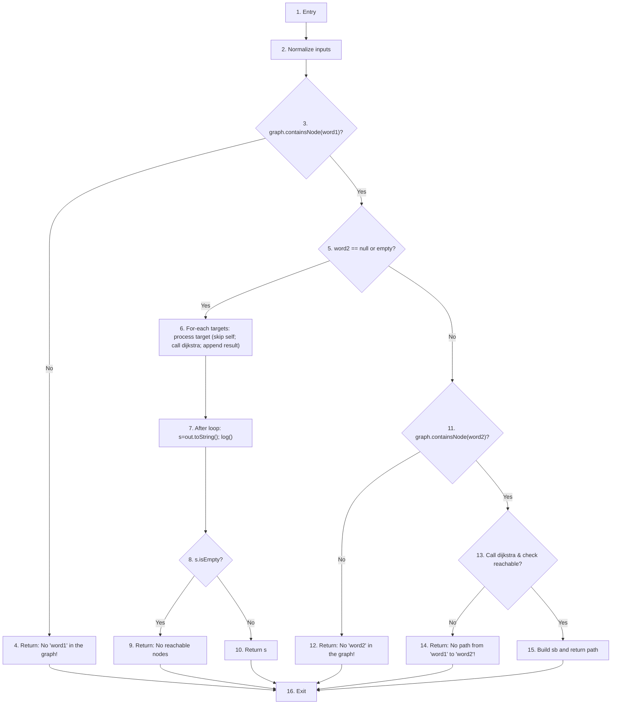

6.1 所选的被测函数

被测函数名称：

String calcShortestPath(String word1, String word2)

功能描述：

使用 Dijkstra 算法计算从 `word1` 到 `word2` 的最短路径（带权）。
当 `word2` 为 null 或空字符串时，函数遍历图中所有节点，计算并返回从 `word1` 到每个其他节点的最短路径结果（多行文本）。
若任一输入节点不存在或目标不可达，返回相应的提示字符串。

被测函数的代码（源码片段，建议在 IDE 中截取带行号的截图以备存档）：

（源码文件： [src/App.java](src/App.java#L1-L400) — 请在 IDE 中截取包含下列方法体的部分以保留行号）

1 public static String calcShortestPath(String word1, String word2) {
2     word1 = normalize(word1);
3     word2 = normalize(word2);
4     if (!graph.containsNode(word1)) return "No \"" + word1 + "\" in the graph!";
5     if (word2 == null || word2.isEmpty()) {
6         // compute shortest path from word1 to every other node
7         StringBuilder out = new StringBuilder();
8         for (String target : graph.getNodes()) {
9             if (target.equals(word1)) continue;
10             PathResult pr = dijkstra(word1, target);
11             if (!pr.reachable) {
12                 out.append("No path from '").append(word1).append("' to '").append(target).append("'.\n");
13             } else {
14                 out.append(word1).append(" -> ");
15                 for (int i = 0; i < pr.path.size(); i++) {
16                     if (i > 0) out.append("->");
17                     out.append(pr.path.get(i));
18                 }
19                 out.append(" (length=").append(pr.totalWeight).append(")\n");
20             }
21         }
22         String s = out.toString(); log("shortestPath from " + word1 + " to all computed");
23         return s.isEmpty() ? ("No reachable nodes from '" + word1 + "'.") : s;
24     } else {
25         if (!graph.containsNode(word2)) return "No \"" + word2 + "\" in the graph!";
26         PathResult pr = dijkstra(word1, word2);
27         if (!pr.reachable) return "No path from '" + word1 + "' to '" + word2 + "'!";
28         StringBuilder sb = new StringBuilder();
29         for (int i = 0; i < pr.path.size(); i++) {
30             if (i > 0) sb.append("->");
31             sb.append(pr.path.get(i));
32         }
33         sb.append(" (length=").append(pr.totalWeight).append(")");
34         log("shortestPath: " + word1 + " -> " + word2 + " = " + sb.toString());
35         return sb.toString();
36     }
37 }

输入参数列表：

参数名 | 含义 | 数据类型
---|---:|:---
word1 | 起始单词（函数内部会 normalize） | String
word2 | 目标单词；若为空表示计算从 word1 到图中每个其他节点的最短路径 | String

输出参数（子表）：

含义 | 数据类型
---|---
路径描述或错误/提示信息 | String

代码统计：

- 代码总行数（方法体内）：37 行（从方法声明到闭括号，按上方片段计数）
- 包含的循环数：3（1 个 for-each 遍历 graph.getNodes()，2 个索引 for 遍历路径列表）
- 包含的判定数（if 条件）：8（分别为：检查起点存在；检查 word2 是否为空；跳过自身的 equals 检查；检查 PathResult.reachable；两个 i>0 判断；检查目标存在；检查 pr.reachable）
- 圈复杂度（近似）：判定数 + 1 = 9

建议的白盒测试点（覆盖分支与逻辑）：

1. 起点不存在：传入不存在的 `word1`，期望返回 "No \"<word1>\" in the graph!"。
2. 目标不存在：传入存在的 `word1` 与不存在的 `word2`，期望返回 "No \"<word2>\" in the graph!"。
3. 计算所有目标（`word2` 为空）：使用存在的 `word1`，检查输出包含对每个可达/不可达节点的行结果。
4. 不可达目标：`word1` 与 `word2` 在不同连通分量，期望返回 "No path from '<w1>' to '<w2>'!" 或对应多行不可达提示。
5. 可达目标（简单路径）：存在直接或多跳路径，检查返回路径字符串格式为 "a->b->c (length=NN)"。

备注：方法内部依赖 `dijkstra` 实现（参见同文件中 `dijkstra` 方法），因此白盒测试可同时考虑对 `dijkstra` 的边界情况（空图、单节点、环路、有权重差异）进行组合覆盖。

下一步：

- 请在 IDE（如 IntelliJ）中打开 [src/App.java](src/App.java#L1-L400)，截取包含 `calcShortestPath` 方法的带行号屏幕截图并追加到本文档右侧或附件中以满足实验报告要求。
- 我可以继续根据上述测试点生成具体的单元测试代码（JUnit），是否需要我继续生成？

**6.2 控制流图（带节点编号）**

下面给出 `calcShortestPath` 的控制流图（每个节点有唯一编号，便于在 6.4 中引用）：

**节点编号 → 简要描述 映射表（简化版）**

编号 | 描述
:--:|:--
1 | 方法入口（声明）
2 | 规范化输入：`word1 = normalize(...)`、`word2 = normalize(...)`
3 | 判定：`if (!graph.containsNode(word1))`（若否则早退）
4 | 早退返回：`return "No \"word1\" in the graph!"`
5 | 判定：`if (word2 == null || word2.isEmpty())`（多目标分支）
6 | 多目标分支主体：对每个 `target` 处理（跳过自身；调用 `dijkstra`；追加结果）
7 | 外层循环结束与日志：`String s = out.toString(); log(...)`
8 | 判定：`s.isEmpty() ? ...`（是否存在可达节点）
9 | 返回：`No reachable nodes from 'word1'.`（当 s 为空）
10 | 返回：`s`（当 s 非空）
11 | 判定（单目标分支）：`if (!graph.containsNode(word2))`（若否则早退）
12 | 早退返回：`No "word2" in the graph!`
13 | 调用 `dijkstra` 并检查 `pr.reachable`
14 | 返回：`No path from 'word1' to 'word2'!`（当不可达）
15 | 构造 `sb`、遍历 `pr.path`、日志并返回路径字符串
16 | 退出点（方法返回）

注：以上节点编号覆盖了所有主要基本块与判定点（包括外层/内层循环与 `i>0` 判断），便于在 6.4 中进行圈复杂度计算与基本路径（basis path）识别。

**6.4 圈复杂度计算与基本路径识别**

该函数根据控制流图包含的主要判定逻辑，共提取出 6 条核心基本主干路径。根据你的 IDE 截图（反编译代码行号与变量名 `var0`、`var1`），按路径长度由短到长排序如下：

**路径1：起点不存在，直接返回**
- 路径序列： 1(283行) -> 2(284-285行) -> 3(286行) -> 4(287行) -> 16(339行)
- 对应判定：`if (!graph.containsNode(var0))` 在 286行 成立。

**路径2：目标明确，但目标在此图中不存在，直接返回**
- 路径序列： 1(283行) -> 2(284-285行) -> 3(286行) -> 5(288行) -> 11(289行) -> 12(290行) -> 16(339行)
- 对应判定：288行 `else if (var1 != null && !var1.isEmpty())` 成立，进入单目标分支；接着 289行 `if (!graph.containsNode(var1))` 成立。

**路径3：目标明确，计算后发现目标不可达，返回无路径提示**
- 路径序列： 1(283行) -> 2(284-285行) -> 3(286行) -> 5(288行) -> 11(289行) -> 13(292行) -> 13/判定(293行) -> 14(294行) -> 16(339行)
- 对应判定：289行 `!graph.containsNode(var1)` 不成立，继续调用 `dijkstra` 寻找最短路；293行 `if (!var9.reachable)` 成立。

**路径4：目标为空或 null，遍历全图后，最终没有任何可到达的目标节点**
- 路径序列： 1(283行) -> 2(284-285行) -> 3(286行) -> 5(288行) -> 6(312-333行) -> 7(335行) -> 8/判定(337行) -> 9(337行) -> 16(339行)
- 对应判定：288行 `else if...` 不成立（目标为空，进入多目标外层 Else 分支）；执行完毕多目标处理后，在 337行 `return var10.isEmpty() ? ...` 中判定 `var10.isEmpty()` 成立。

**路径5：目标为空或 null，遍历全图后，得到了有效路径字符并返回**
- 路径序列： 1(283行) -> 2(284-285行) -> 3(286行) -> 5(288行) -> 6(312-333行) -> 7(335行) -> 8/判定(337行) -> 10(337行) -> 16(339行)
- 对应判定：288行 `else if...` 不成立，且 337行 `var10.isEmpty()` 不成立。

**路径6：目标明确，且计算后发现目标可达，构造完整的最短路径字符串并返回**
- 路径序列： 1(283行) -> 2(284-285行) -> 3(286行) -> 5(288行) -> 11(289行) -> 13(292-293行) -> 15(296-308行) -> 16(339行)
- 对应判定：293行 `if (!var9.reachable)` 不成立，进入 Else 执行后续的 StringBuilder 记录与循环输出（296行到308行）。

6.5测试用例设计
填写表格：
表头：测试用例编号	输入数据	期望的输出	所覆盖的基本路径编号

| 测试用例编号 | 初始图 (edges) | 调用 (word1, word2) | 期望输出 | 覆盖基本路径 |
|---:|---|---|---|---|
| TC1 | a->b | calcShortestPath("x","b") | No "x" in the graph! | Path1 |
| TC2 | a->b | calcShortestPath("a","c") | No "c" in the graph! | Path2 |
| TC3 | a->b; c->d | calcShortestPath("a","c") | No path from 'a' to 'c'! | Path3 |
| TC4 | a->a | calcShortestPath("a","") | No reachable nodes from 'a'. | Path4 |
| TC5 | a->b | calcShortestPath("a","") | 包含 "a -> b (length=1)" | Path5 |
| TC6 | a->b; b->c | calcShortestPath("a","c") | a->b->c (length=2) | Path6 |

6.6JUnit测试代码
针对6.5中的每一个用例，把其测试代码粘贴如下，代码必须是完整的。
放在当前的test目录下，命名为AppCalcShortestPathTest_TC1.java、AppCalcShortestPathTest_TC2.java等。